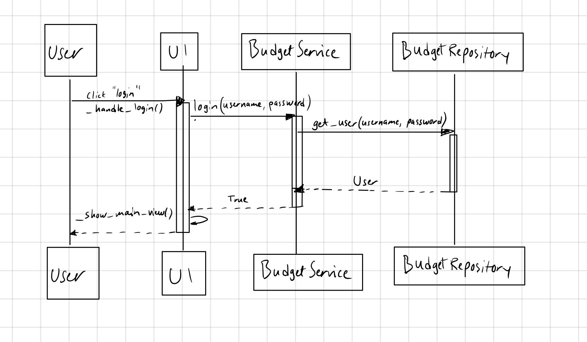

# Arkkitehtuurikuvaus

## Pakkaus- ja luokkakaavio

Pakkauskaavio kuvastaa sovelluksen suunniteltua tilaa. 

## Toiminnallisuudet

### Käyttäjän kirjautuminen

Alla olevassa sekvenssikaaviossa on kuvattu käyttäjän onnistunut sisäänkirjautuminen.

