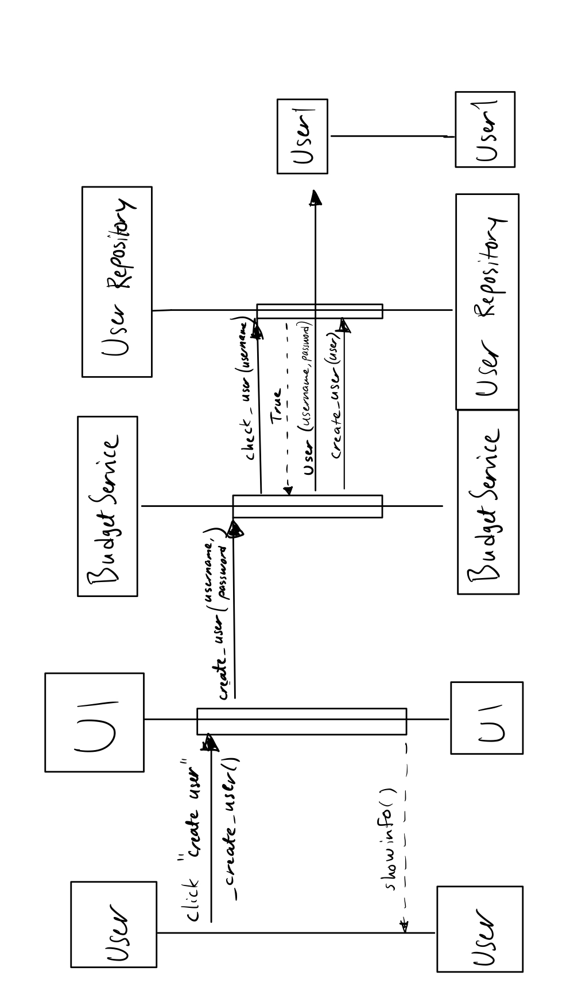

# Arkkitehtuurikuvaus

Ohjelman rakenne perustuu kolmikerroksiseen kerrosarkkitehtuuriin. Pakkaus ui vastaa käyttöliittymän toteutuksesta, pakkaus services sovelluslogiikasta ja pakkaus repositories tiedon pysyväistallennuksesta. Pakkaus entities sisältää luokat, jotka muodostavat sovelluksen loogisen tietomallin.

## Pakkaus- ja luokkakaavio

Pakkauskaavio kuvastaa sovelluksen suunniteltua tilaa. 

## Käyttöliittymä

Sovelluksen käyttöliittymä on toteutettu neljällä luokalla UI, LoginView, MainView ja BudgetView. Luokka UI vastaa käyttöliittymän kahden eri näkymän (kirjautumissivu ja päänäkymä) näyttämisestä. Kirjautumissivu toteutetaan LoginView luokan avulla ja päänäkymä MainView ja BudgetView luokkien avulla. MainView luo kehyksen kirjautuneen käyttäjän budjeteille ja mahdollistaa uuden budjetin lisäämiseen uuteen välilehteen. BudgetView-luokan avulla kuvataan yhtä auki olevaa budjettia. 

Käyttöliittymän painikkeet kutsuvat BudgetService-luokan metodeita, jotka vastaavat sovelluksen toiminnallisuuksista.

## Sovelluslogiikka

Sovelluslogiikasta vastaa yksi luokka BudgetService, joka käyttää repositories ja entities -pakkausten luokkia. BudgetService vastaa myös suurelta osin syötteiden validoinnista. Tietokantaa käyttävät repositories-luokat injektoidaan sovelluslogiikalle testauksen helpottamiseksi.

## Tietojen pysyväistallennus

Tietojen pysyväistallennuksesta vastaavat repositories-pakkauksen luokat BudgetRepository ja UserRepository. Luokat tallentavat käyttäjiin ja budjetteihin liittyviä tietoja SQLite-tietokantaan. Tietokanta tauluineen alustetaan ennen sovelluksen ensimmäistä käynnistyskertaa käyttöohjeissa kuvatulla tavalla. Alustus tapahtuu  avulla. 

## Toiminnallisuudet

### Käyttäjän kirjautuminen

Alla olevassa sekvenssikaaviossa on kuvattu käyttäjän onnistunut sisäänkirjautuminen.

Käyttäjätunnuksen ja salasanan syöttämisen jälkeen login-painike käynnistää tapahtumakäsittelijän, joka kutsuu BudgetService metodia login. Seuraavaksi login-metodi kutsuu UserRepository luokan metodia get_user, joka luo ja palauttaa User-olion, jos tietokantaan tallennettu käyttäjätunnus ja salasana täsmäsivät. Tämän jälkeen metodi login palauttaa saman User-olion käyttöliittymälle, joka vaihtaa aktiiviseksi näkymäksi MainView-luokan tuottaman näkymän.

Jos käyttäjätunnus ja salasana eivät täsmää, ei User-oliota palauteta käyttöliittymälle ja käyttöliittymä tuottaa virheilmoituksen.

### Käyttäjän luominen

Alla olevassa sekvenssikaaviossa on kuvattu uuden käyttäjän luominen.

Käyttäjätunnuksen ja salasanan syöttämisen jälkeen create user -painike käynnistää tapahtumakäsittelijän, joka kutsuu BudgetService metodia create_user. Sovelluslogiikka tarkistaa UserRepository metodin check_user avulla, että kyseistä käyttäjää ei löydy tietokannasta. Tämän jälkeen luodaan uusi User-olio ja sovelluslogiikka tallentaa uuden käyttäjän UserRepositoryn create_user-metodilla tietokantaan. Jos virheilmoituksia ei ilmene, käyttöliittymä näyttää käyttäjälle viestin onnistuneesta uuden käyttäjän luonnista. 

Sovelluslogiikka antaa virheen, jos käyttäjätunnus on jo olemassa tietokannassa. User olion luominen antaa myös virheen, jos käyttäjänimi ja salasana eivät täytä annettuja vaatimuksia. Nämä virheviestit välitetään käyttöliittymän kautta sovelluksen käyttäjälle.

### Budjetin luominen

Alla olevassa sekvenssikaaviossa on kuvattu uuden budjetin luominen.

Budjetin nimen syöttämisen jälkeen create budget -painike käynnistää tapahtumakäsittelijän, joka luo uuden Budget-olion ja kutsuu BudgetService metodia create_budget. create_budget kutsuu BudgetRepositoryn metodia create_budget, joka tallentaa budjetin tietokantaan. Tämän jälkeen sovelluslogiikan metodi create_budget palauttaa Budget-olion käyttöliittymälle ja käyttöliittymä päivittää sovelluksen päänäkymän. 

Jos budjetin nimen pituus on liian lyhyt tai pitkä, sovelluslogiikka palauttaa käyttöliittymälle False ja käyttöliittymä tuottaa virhesanoman.

### Muut toiminnallisuudet

Sovelluksen muut toiminnallisuudet toimivat vastaavalla tavalla kuin edellä esitellyt. Käyttöliittymän painikkeilla käynnistetään tapahtumakäsittelijä, joka kutsuu BudgetService-luokan metodeja. Nämä metodit käyttävät services-pakkauksen luokkia, jotka suorittavat tietojen tallennuksen ja haun tietokannasta. Tietokannan muokkauksen jälkeen käyttöliittymän näkymä päivitetään, jotta muutokset näkyvät käyttäjälle.