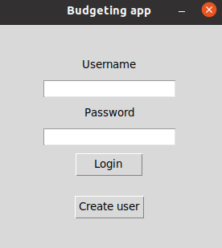
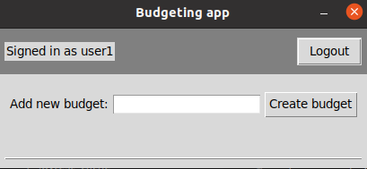
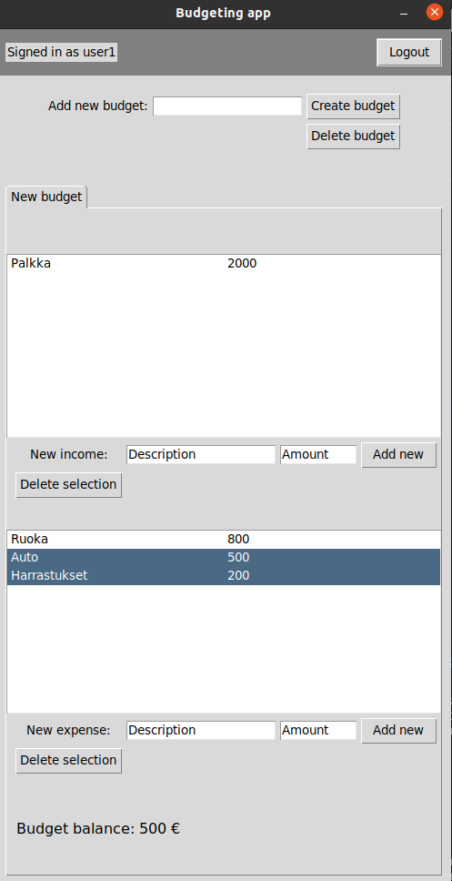

# Käyttöohje

## Konfigurointi

Ennen tietokannan alustamista src hakemiston alla olevasta .env tiedostosta voi valita käytettävän
tietokannan nimen. Tietokanta nimetään oletuksena database.sqlite-nimiseksi.


## Ohjelman käynnistäminen

1. Asenna riippuvuudet komennolla<br>
```bash
    poetry install
```

2. Alusta tietokanta komennolla<br>
```bash
    poetry run invoke build
```

3. Käynnistä sovellus komennolla<br>
```bash
    poetry run invoke start
```


## Kirjautuminen

Ohjelman käynnistettäessä aukeaa kirjautumissivu josta voi kirjautua sisään valitsemalla syöttämällä kirjautumistiedot ja painamalla login. Uuden käyttäjän pystyy vastaavasti luomaan painamalla create user -painiketta.




## Uudet budjetin luonti ja poistaminen

Kirjautumisen jälkeen aukeaa sovelluksen päänäkymä, joka on tyhjä jos yhtään budjettia ei ole tehty. Uuden budjetin pystyy luomaan syöttämällä budjetin nimen ja painamalla create budget -painiketta. Tämän jälkeen auki olevan budjetin voi poistaa delete budget -painikkeella. Budjetteja voi luoda useampia ja niiden välillä voi navigoida klikkaamalla budjetin nimen sisältävää välilehteä.




## Tulojen ja menojen lisäys ja poisto

Tuloja ja menoja voi lisätä täyttämällä Description ja Amount -kentät sekä painamalla Add new -painiketta. Tuloja ja menoja voi poistaa yhden tai useamman kerralla klikkaamalla haluttuja rivejä ja painamalla Delete selection -painiketta. 



