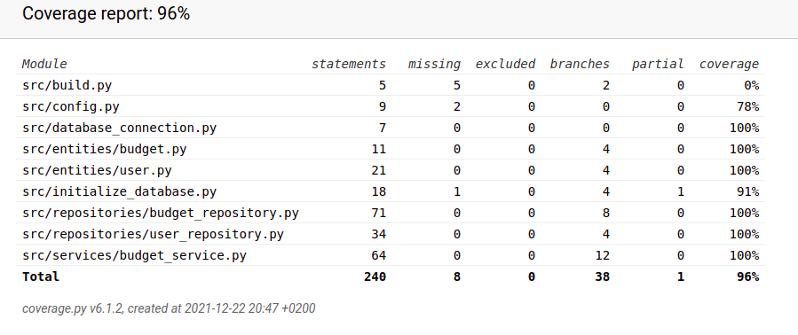

# Testausdokumentti

## Yksikkö- ja integraatiotestaus

Yksikkö- ja integraatiotestaus on toteutettu unittest-kirjaston avulla. Testejä on suoritettu komentoriviltä pytest-sovelluskehyksen avulla. Projektin juurihakemistosta löytyvä .env.test-tiedosto sisältää testauksissa käytettävät ympäristömuuttujat ja src-hakemiston alla olevan pytest.ini-tiedoston avulla määritellään pytestin käyttämät ympäristömuuttujat.

Sovelluslogiikkaa testattaessa TestBudgetService-luokalla on tietokantaoperaatioista vastaavat repository-luokat korvattu FakeBudgetRepository ja FakeUserRepository luokilla, jotka injektoidaan BudgetService oliolle TestBudgetService-olion alustuksessa. Muissa testeissä käytetään sovelluksen oikeita luokkia. 

### Testikattavuus

Sovelluksen testauksen haaraumakattavuus on 96%.

## Järjestelmätestaus

Järjestelmätestaus on suoritettu kokeilemalla kaikki vaatimusmäärittelyssä ja käyttöohjeessa esitellyt toiminnallisuudet. Sovellusta on testattu antamalla virheellisiä, todella pitkiä tai tyhjiä syötteitä. 

## Ohjelmaan jääneet heikkoudet

Käyttöliittymän osalta ohjelman koodissa on hieman toisteisuutta. 
Ohjelma ei anna virheilmoitusta, jos yrittää syöttää tulon tai menon väärillä arvoilla (Kuvauksen tulee olla 1-20 merkkiä ja määrän jokin lukuarvo). 